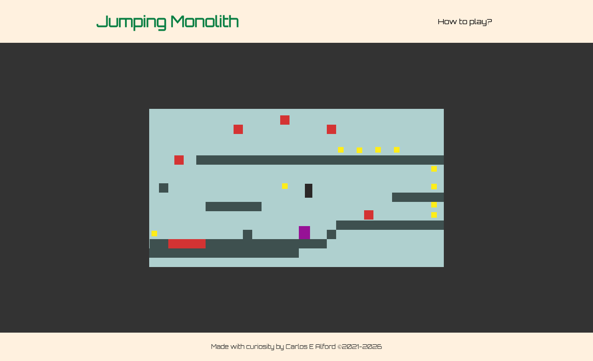

# Jumping Monolith :video_game:

Browser based platform game, where player is a monolith jumping around collecting coins while avoiding the lava and crushing enemies. `^_^`

## About

As part of my journey to stay ahead and from curiosity I read a book called _Eloquent JavaScript_ by _Marijn Haverbeke_ which goes through concepts in a clear way with examples and questions to test what you have learned. I really enjoyed it.

One of the chapters spoke about creating a game engine with code examples to create a simple game. It was a block that moved around avoiding obstacles. It was so good that it wet my curiosities appetite and I decided to take it further.

The current engine is combination of the code from the tutorial and my own. It will keep evolving and improving.
This version of the game uses the DOM to draw out the game, therefore it may not perform games console smooth.

## Play the game

Go to [game](https://webshuriken.github.io/jumping-monolith/).

## Built with

- HTML
- CSS
- JS (ES6)
- TypeScript
- Currently the game does not support touch screen devices.

## Test locally

Because we use `ES6` modules and due to CORS policy the game can't be run directly from the file.

- VS Code: Install the Live Server extension. Once installed, clicke ont he "Go Live" button at the bottom of the editor.
- Python: If you have Python installed, run this in your project folder: `python -m http.server`
- Node.js: If you prefer Node, run `npx serve`

## Screenshot

## Game Features

**Lava:**

- able to move vertically
- able to move horizontally
- drips from the a set location vertically, resetting once it hits the ground

**Enemies:**

- able to moves horizontally

**Player:**

- moves left and right at constant speed
- jumps at constant height regardless of keypress length
- destroys enemies by jumping on top of them

**Level:**

- player only gets 3 tries per level
- player lives reset back to 3 on each new level

## Road map

This sections has grown too large to be kept here.

See [Road map](ROADMAP.md) for details.

## Authors

Website implementation and code customization.

- [Carlos E Alford M](https://carlosealford.com)

## Contributing

If you have any levels you want to add please see [Contributing](CONTRIBUTING.md).

## License

- [MIT License](LICENSE.md)

## Acknowledgements

Thanks to [Eloquent JavaScript](https://eloquentjavascript.net/) written by Marijn Haverbeke. The base engine for the game comes from chapter 16: A Platform Game.
